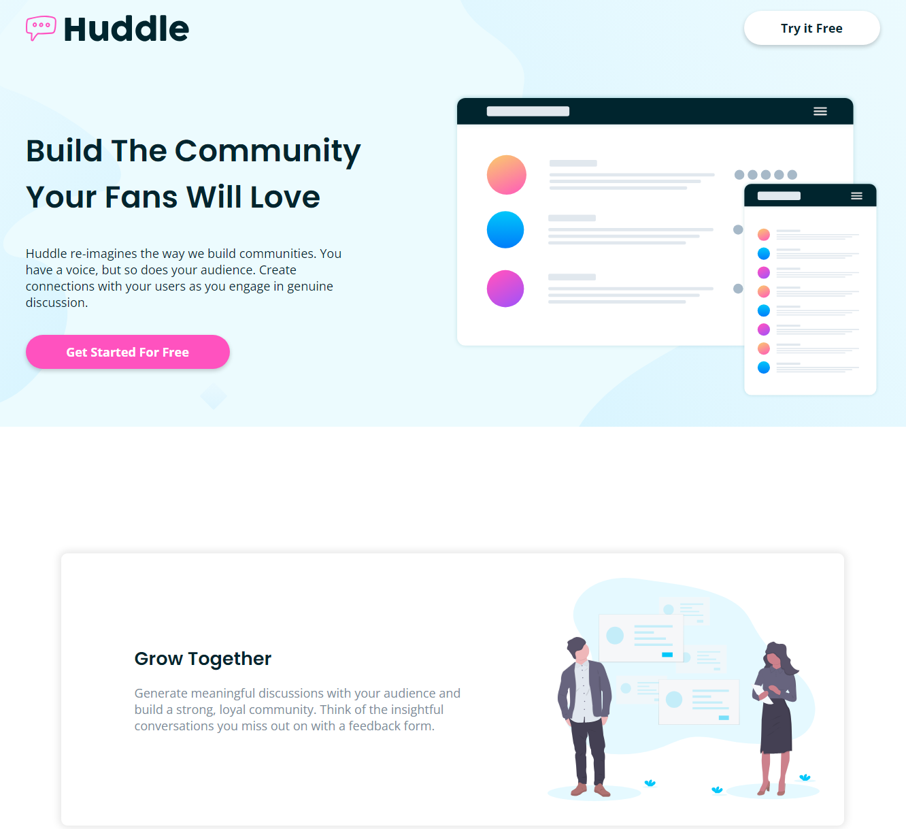

# Frontend Mentor - Huddle landing page with alternating feature blocks solution

This is a solution to the [Huddle landing page with alternating feature blocks challenge on Frontend Mentor](https://www.frontendmentor.io/challenges/huddle-landing-page-with-alternating-feature-blocks-5ca5f5981e82137ec91a5100). Frontend Mentor challenges help you improve your coding skills by building realistic projects.

## Table of contents

- [Overview](#overview)
  - [The challenge](#the-challenge)
  - [Screenshot](#screenshot)
  - [Links](#links)
- [My process](#my-process)
  - [Built with](#built-with)
  - [What I learned](#what-i-learned)
  - [Continued development](#continued-development)
- [Author](#author)

## Overview

### The challenge

Users should be able to:

- View the optimal layout for the site depending on their device's screen size
- See hover states for all interactive elements on the page

### Screenshot

### Links

- Github URL: [Github URL](https://github.com/exchyphen/fm_huddle-landing-with-alternating)
- Live Site URL: [live site hosted by Github Pages](https://exchyphen.github.io/fm_huddle-landing-with-alternating/)

## My process

### Built with

- HTML
- CSS
- React

### What I learned

Lots of practice with structuring, layouts, and general CSS. Good improvement on creating reusable/common CSS classes.

### Continued development

Possibly restructuring and renaming CSS classes. Now that we know to use more wrappers/containers especially for the larger view sizes, we can more appropriately name them.

## Author

- Github - [exchyphen](https://github.com/exchyphen)
- Frontend Mentor - [@exchyphen](https://www.frontendmentor.io/profile/exchyphen)
